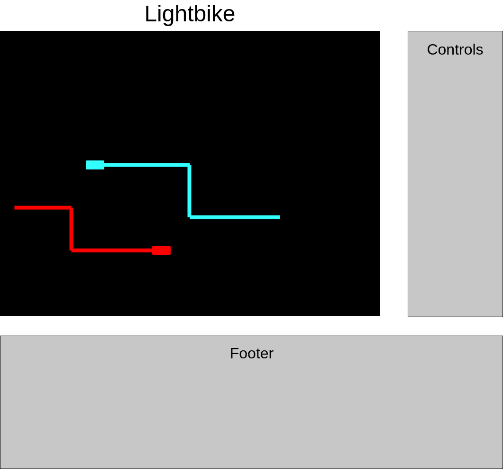

## Lightbike - Ride the Waves

### Background and Overview

Lightbike is a browser game inspired by the 1982 film Tron in which players compete to outmaneuver their opponents. Lightbikes create impassable walls of light in their path (similar to the classic game snake) that serve as obstacles for other players. A player who crashes his or her bike into a wall is eliminated.

### Functionality & MVP  

In Lightbike, players will be able to:

- [ ] Choose the color of their bike
- [ ] Play against another player locally
- [ ] Play against up to three AI opponents
- [ ] Start, pause, and restart the game

In addition, this project will include:

- [ ] Clean modern styling
- [ ] Music and sound effects
- [ ] Instructions explaining the game's controls and features

### Wireframes

This app will consist of a single page that includes the game canvas, controls, and game description. A footer will container nav links to my Github and LinkedIn profiles.

Time permitting, the game canvas itself may include a menu with the option to view controls and change settings like music.

### Architecture and Technologies

This project will be implemented with the following technologies:

- Vanilla JavaScript for overall structure and game logic,
- `HTML5 Canvas` for DOM manipulation and rendering,
- `Web Audio API` for sound generation, processing and control
- Webpack to bundle and serve up the various scripts.

In addition to the webpack entry file, there will be several scripts involved in this project:

`app.js` Entry file for the application

`game.js` Primary game logic including functions to run, render, start, stop, and pause the game

`player.js` This file manages the logic for each player (local or computer)

`bike.js`: this script will handle the details for rendering each player's bike

`wall.js`: this script will house the physics logic for the walls created by each bike

`audio.js`: this script will handle the audio logic for the game music and sound effects

### Implementation Timeline

**Over the weekend**:
- [x] View completed javascript projects for ideas and inspiration
- [x] Plan out project features and MVP timeline
- [x] Complete tutorial on HTML5 canvas elements
- [x] Build and configure the project skeleton

**Day 1**:

- [ ] Get a working implementation of `app.js` and `game.js`
- [ ] Write a basic `bike.js` and render it to the canvas
- [ ] Begin implementation of `player.js` for human players

**Day 2**:

- [ ] Implement player controls to be able to move a bike around the map
- [ ] Write an initial `wall.js` implementation that draws walls behind the bike
- [ ] Add collisions to walls
- [ ] Write game pause, start, reset, and gameover features

**Day 3**:

- [ ] Add support for two players
- [ ] Write the AI for computer players
- [ ] Add a game menu that allows the player to choose between computer or human opponents

**Day 4**:

- [ ] Add game score
- [ ] Have a styled `Canvas`, nice looking controls and title
- [ ] Address and remaining bugs / unfinished featuers

### Bonus features

There are many directions in which this project could evolve.

- [ ] Add advanced visual effects
- [ ] Enable multiplayer over a network using web sockets
- [ ] Write a simple backend for saving high scores and profiles
