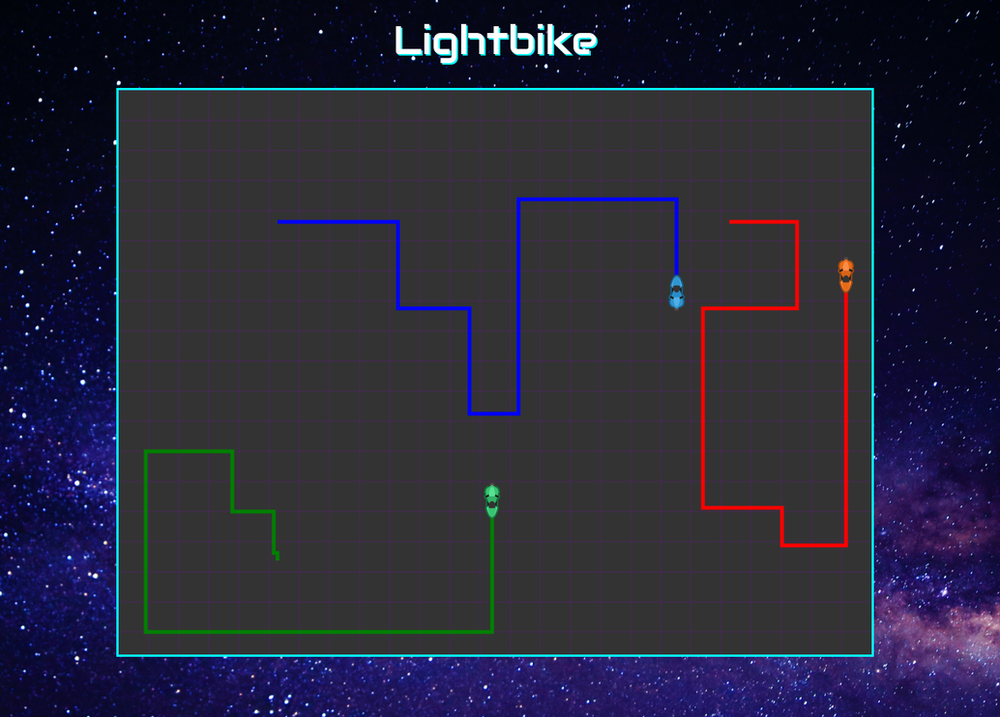

## Lightbike

### Summary

Lightbike is a browser game inspired by the 1982 film Tron in which players compete to outmaneuver their opponents. Lightbikes create impassable walls of light in their path (similar to the classic game snake) that serve as obstacles for other players. A player who crashes his or her bike into a wall is eliminated.

### Functionality & MVP  

In Lightbike, players will be able to:

- [ ] Play against another player locally
- [ ] Play against up to three AI opponents
- [ ] Start and restart the game

In addition, this project will include:

- [ ] Clean modern styling
- [ ] Music and sound effects
- [ ] Instructions explaining the game's controls

### Architecture and Technologies

This project will be implemented with the following technologies:

- Vanilla JavaScript for overall structure and game logic,
- `HTML5 Canvas` for DOM manipulation and rendering,
- `Web Audio API` for sound generation, processing and control
- Webpack to bundle and serve up the various scripts.

In addition to the webpack entry file, there will be several scripts involved in this project:

`app.js` Entry file for the application

`game.js` Primary game logic including functions to run, render, start, stop, and pause the game

`player.js` This file manages the logic for each player (local or computer)

`bike.js`: this script will handle the details for rendering each player's bike

`wall.js`: this script will house the physics logic for the walls created by each bike

### Bonus features

There are many directions in which this project could evolve.

- [ ] Add advanced visual effects
- [ ] Enable multiplayer over a network using web sockets
- [ ] Write a simple backend for saving high scores and profiles
